This is a simple "how to" document that describes how to make an app with a custom view in Swift3 using Xcode.  My current version of Xcode is 8.2.1.

### Custom view

Start by making a new Xcode project:

* macOS Cocoa Application
* name:  **SimpleView**
* no tests
* Swift language
* default location (for me, the Desktop)

Next, select the View ***folder*** in the Project navigator.

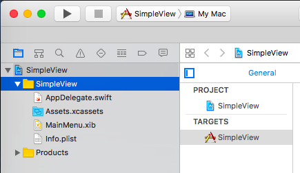

Now do:  **File > New > File >**

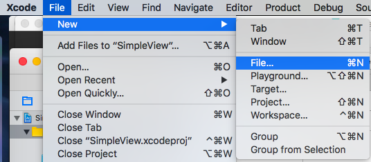

Make this a

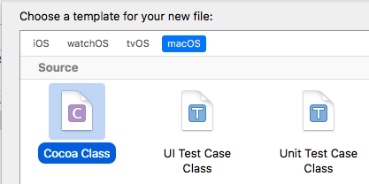

* macOS Cocoa Class
* name:  **MyView**
* subclassing NSView
* Swift language

The second stage of this:

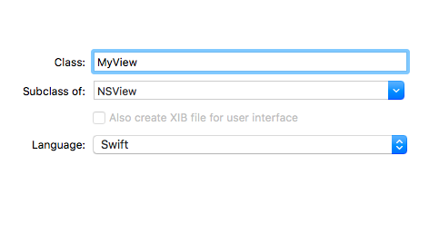

Add the following snippet to the default code generated for the **draw** function in **MyView.swift**:

```css
Swift.print("MyView:  draw")
let backgroundColor = NSColor.cyan
backgroundColor.set()
NSBezierPath.fill(bounds)
```
This uses the new Swift3 syntax, substituting **.cyan** for **.cyanColor()**.

Optional:  if you want to check this code you *could* do this:

* click on **MainMenu.xib**
* In IB click on the window's title bar
* When the Identity Inspector shows NSView you have reached the window's Content View
* change its class to MyView
* Build and run

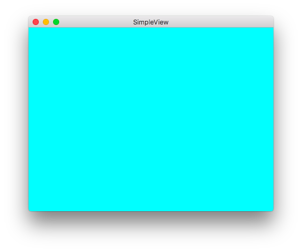

Now revert that change.

Life will be better with a Window Controller.  If we create the new .swift file, Xcode will make the corresponding .xib file for us.

Select the SimpleView *folder* in the Project view.

Now do:  **File > New > File >**

* macOS Cocoa Class
* name:  **MainWindowController**
* subclassing NSWindowController
* Swift language


Make sure to check Also create XIB file. 

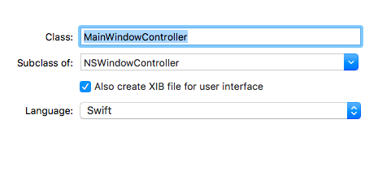 

If you build and run at this point you'll see a window but it's not this one.  We have to tell our window to appear on screen.


In the **AppDelegate** (just below the Class declaration) and the IBOutlet declaration where it says 

```css
@IBOutlet weak var window: NSWindow!
```

 add this code so it reads

```css
@IBOutlet weak var window: NSWindow!
var mainWindowController: MainWindowController?
```

Also, put something else in **applicationDidFinishLaunching**.  We add a window controller corresponding to a .xib file of the same name.

```css
let mwc = MainWindowController(windowNibName: "MainWindowController")
mwc.showWindow(self)
```
The Hillegass book says:  do setup first, then assignment.  So now set the property to point to the window controller we just made

```css  
self.mainWindowController = mwc
```

(I might have resisted the urge to shorten "mainWindowController" to "mwc" here).

I also removed **applicationWillTerminate** from this file.

In the Project navigator, click on the new MainWindowController.xib file.  Place a custom view in the the window.  

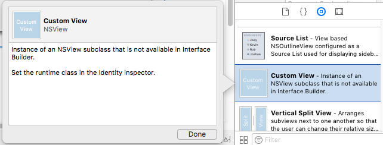 

With the view selected

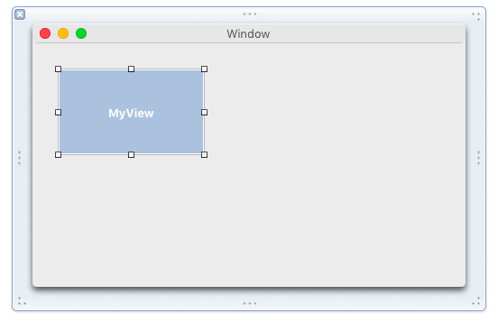 

in the Identity Inspector, set its class to MyView.

Run and see the custom view turn cyan.  

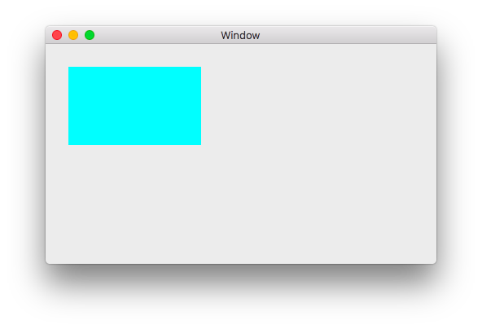 

### Actions

IBActions are connected to File's Owner seen in the "nib" (generated from the .xib file) which propagates the action to our MainWindowController.  Put this code in **MainWindowController.swift**:

```css
@IBAction func button_pushed(sender: AnyObject) {
    	Swift.print("MWC:  button_pushed")
    }
```

Open **MainWindowController.xib** and drag a button onto the window.  Control-drag from the button to **File's Owner** and click on **button_pushedWithSender**.
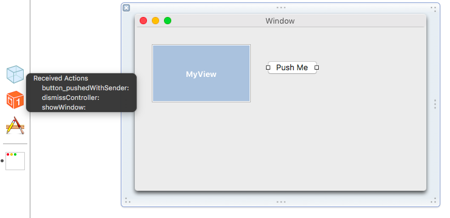 

**File's Owner** is the blue cube on the left.  The button is first selected before the drag.  In the black box that appears after the drag you will see **button_pushedWithSender**.  (Our method has had **WithSender** appended to it).

Build and run and the log (in the Debug area) will show the first line of:

```css
MyView:  draw
MWC:  button_pushed
```

You will get the second line after you push the button in the running app.

Our question at this point is:  how to handle an IBAction in MyView?  Xcode will not allow connection of the button in IB to the Custom View 
even if the function code is in **MyView.swift**.

We can get "key events" in the view by doing this:

```css
override var acceptsFirstResponder: Bool { return true }
```

but that's another story.

So, we have to receive the action of the button in the MWC, but then call code elsewhere.  Which files have their functions visible across our code?  It turns out that simple Swift files are visible, but **MyView.swift** is not.  We need to explicitly hook it up.  Put this in **MyView.swift**

```
func myViewDoIt() {
        Swift.print("MyView:  myViewDoIt")
    }
```

As mentioned, this code cannot be called directly from the MWC, even if we add this to **MainWindowController.swift**

```
@IBAction func button_pushed(sender: AnyObject) {
        Swift.print("MWC:  button_pushed")
        myViewDoIt()
    }
```

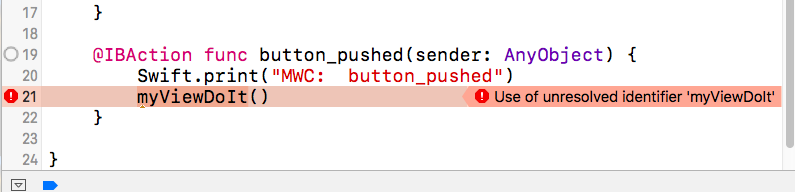 

We need to let the MainWindowController "know about" MyView.  Put this code into **MainWindowController.swift** just after the class declaration.

```css
class MainWindowController: NSWindowController {
    
    @IBOutlet weak var myView: MyView!
```

Then click on the .xib file and control drag from **File's Owner** to the custom view.  It helps to select the custom view first.  It will show "Outlets".  Choose "myView".  Finally, change the code in **MainWindowController.swift** slightly to


```css
@IBAction func button_pushed(sender: AnyObject) {
        Swift.print("MWC:  button_pushed")
        myView.myViewDoIt()
    }
```

The log reads:

```css
MyView:  draw
MWC:  button_pushed
MyView:  myViewDoIt
```

Select the View ***folder*** in the Project view, do:  **File > New > File >** and make a new Swift file called **Helper.swift**.

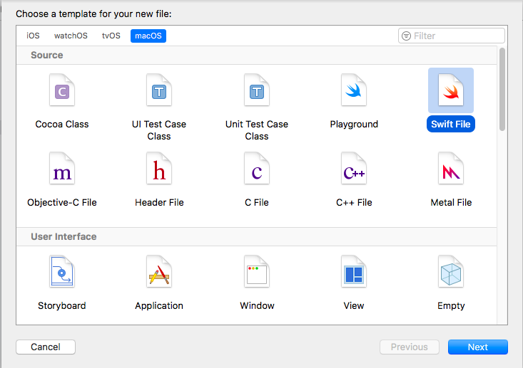 

In the new file, place this function:

```css
import Foundation

func helperDoIt() {
    Swift.print("Helper:  helperDoIt")
}
```

and modify the call in **MainWindowController.swift** to read:

```css
    @IBAction func button_pushed(sender: AnyObject) {
        Swift.print("MWC:  button_pushed")
        myView.myViewDoIt()
        helperDoIt()
    }
```

Build and run the app, and push the button, and the log will read

```css
MyView:  draw
MWC:  button_pushed
MyView:  myViewDoIt
Helper:  helperDoIt
```

We can pass data from the helper to the calling function just by returning it.  However, you may occasionally need to obtain a reference to the MainWindowController (or the View) from somewhere like **Helper.swift**.

We can get a reference to the App Delegate and MWC with:

```css
import Cocoa

let ad = NSApplication.shared().delegate as! AppDelegate
let mwc = ad.mainWindowController!
```

This can be at the top of the file in **Helper.swift**.  Note that the default is **import Foundation**.  But for our swift code to know about **NSApplication** and so on, we need Cocoa.

Put a second button on the window and connect it to File's Owner / MWC to

```csss
@IBAction func button2_pushed(sender: AnyObject) {
    Swift.print("MWC:  button2_pushed")
    helperDoIt2()
}
```

in **MainWindowController.swift**.  Put the following into **Helper.swift**:

```css
func helperDoIt2() {
    Swift.print("Helper:  helperDoIt2")
    mwc.myView.myViewDoIt()
}
```

The log shows:

```css
MyView:  draw
MWC:  button2_pushed
Helper:  helperDoIt2
MyView:  myViewDoIt
```

We have propagated a signal from the button to the MWC to the Helper;  grabbed a reference there to the App Delegate and then to the MWC, to its outlet the View, and then finally called a function in the View.

One last detail about Views.  It happens that code can change the model but the view will not be updated.  The way to force the view to redraw itself is to put something like this in the view

```css
    func refreshScreen() {
        Swift.print("MyView:  refreshScreen")
        self.needsDisplay = true
    }
```

and call it through some variation on what we have above.

Well, that's it for this basic introduction.  Hope this is useful to you, I know it will be for me.

